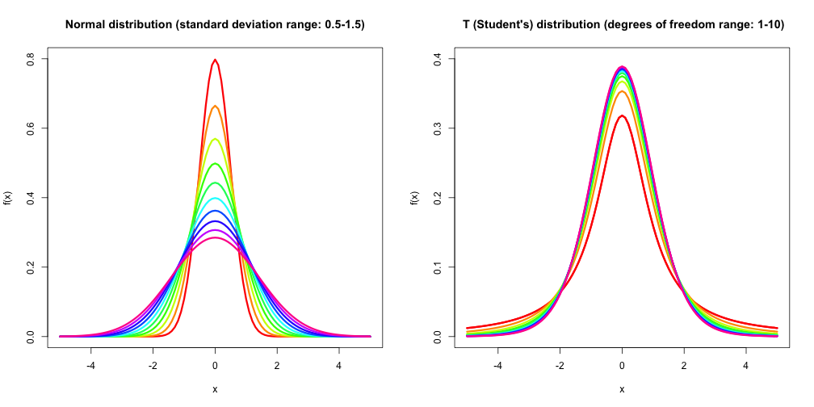
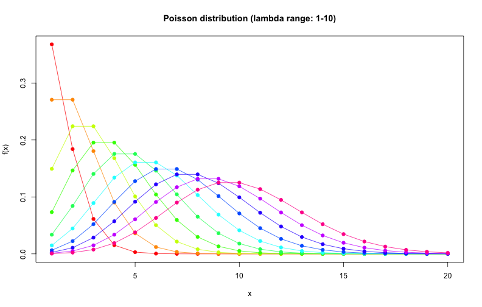

## Introduction.

1. The 'Distribution density functions' application is implemented with Shiny - a web application framework for R.
2. The application's main purpose is to demonstrate plots of 4 different distribution density functions: Normal, T (Student's) distribution, Poisson and Chi-square distrbutions.
3. For each distribution selected a slider is displayed that allows to interactively change the main parameter such as: standard deviation (Normal distribution), degrees of freedom (T distribution, Chi-square distributon) and lambda (Poisson distribution).
4. The application provides additional controls to interactively add/remove vertical lines for the mean and standard deviation to each distribution plot.
5. As a special bonus, the application also provides a control to colorize plots and add a fancy grid to them.

---

## Normal Distribution and T (Student's) Distribution
The two plots below show two sets of curves that the application can draw for each selected value of standard deviation  (Normal Distrubution) or degrees of freedom (T Distribution). (R code is hidden to save slide space - see index.Rmd)

--- .class #id 

## Poisson Distribution
Poisson distribution plot showing 10 curves that the application can draw for each selected value of the lambda parameter. The function is defined only at integer values of x. The connecting lines are only guides for the eye. (code hidden - see index.Rmd for R source code)

---

## Chi-square Distribution
Chi-square distribution plot showing 10 curves that the application can draw for each selected value of degrees of freedom. (code hidden - see index.Rmd for R source code)

